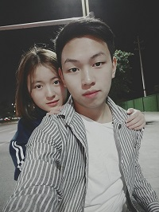

<table border="0">
  <tr>
    <td width="75%">
      <h1 align="center">个人资料</h1>
      
<b>姓名：张小军</b>

      
<b>就读大学：石家庄铁道大学</b>

      
<b>学历：本科</b>

      
<b>专业：软件工程</b>

      
<b>邮箱：1943733515@qq.com</b>

      
<b>家庭地址：贵州省铜仁市德江县，邮编：565200</b>

    </td>
    <td width="25%">
      
    </td>
  </tr>
</table>

---
## 自我认识
### 1、个人基本情况
我今年22岁，目前就读于石家庄铁道大学软件工程专业。进入大学至今成绩尚可，获得过一项软件著作权，已通过大学英语四级考试。内心热爱生活，对未来充满希望。

### 2、职业兴趣
进入大学后，我热爱我所学的软件工程专业，在我内心，编程开发是一件非常有意思的事情和工作。虽然它有时也会给我带来烦恼，但是当我实现了某一功能或程序时，
收获的不仅仅是快乐而已，以往的烦恼也会变得很值得。

### 3、职业能力及适应性
在大学期间，我学会了多项开发编程语言与技术，累积了较丰富的编程经验。在加入工作后，我认为我能很快融入自己的工作以及工作的团队。
### 4、个人性格
在性格方面，我活泼开朗、乐观向上、兴趣广泛、适应力强、上手快、勤奋好学、脚踏实地、认真负责、坚毅不拔、吃苦耐劳、勇于迎接新挑战

### 5、职业价值观
对于一门职业，我最看重的不仅仅是物质的回报，也希望更多的是精神上的满足。脱离物质谈理想是不现实的，而我愿我将来从事的职业可以实现双赢:兼顾现实与理想。
于工作上勤勤恳恳，脚踏实地，与时俱进，实现我看重的人生价值和社会价值的双赢，成就自我，也奉献社会。
### 6、胜任能力——优劣势是什么
(1)优势：首先，从专业知识层面讲，在毕业后，我将掌握系统的医学专业知识，在未来还会到医学院校继续攻读;其次，从精神层面讲，我是一个比较处理事情有条理且自律的人，对于大小事务，我喜欢规划后执行，按时完成某事，这使我在学习和工作上拥有高效率，可以胜任我所向往的职业。对于关乎人生的大事，只要我认定，就很少会改变，并且愿意花费时间去为实现它而做准备。除此之外，我乐观而积极，为人热心，与身边的朋友、同学相处融洽。
(2)劣势：有时候在处理事情方面有些武断，没有经过更深层次的分析，就下结论。喜好独处，少了许多和人交流的机会。大学生活的色彩也太过单调，除了学业相关，没有培养其他的爱好，参与的活动也十分有限。
### 7、自我分析小结
认识自我是职业规划的第一步。综上所述，在有限的生命的价值，是我所想要的。对于我对职业希冀我会努力做到，不改初心里成就无限扬长避短，根据自己的特质走适合自己的职业道路

---

### 最新消息
1. 消息1×××

### 研究方向
- 文本挖掘
- 知识图谱

### 荣誉奖励
- 奖学金
- 荣誉称号
- 比赛获奖

### 项目研究
#### 公司/学校/研究所（2013.9~2017.6）
- **项目1**  
项目描述
- **项目2**  
项目描述

#### 公司/学校/研究所（2017.9~至今）
- **项目1**  
项目描述
- **项目2**  
项目描述
